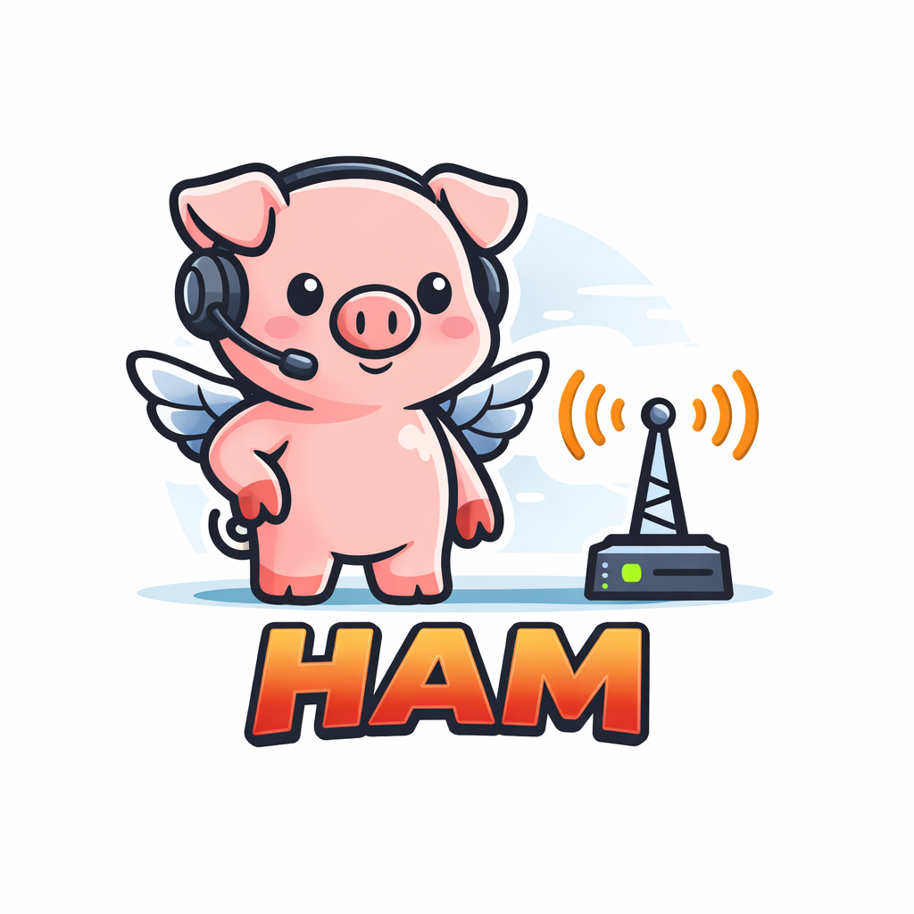

<p align="center">
  
</p>

<h1 align="center">HamHawk</h1>

<p align="center">
  An internet-SDR monitoring workstation — listen to KiwiSDR / OpenWebRX receivers worldwide,
  transcribe &amp; translate voice, decode digital modes, all in an IC-7760-style rig interface.
</p>

---

## What it does

- **Rig-style desktop UI** (Tauri 2 + React + Rust): dual analog S-meters, dual spectrum + waterfall
  scopes, a working tuning knob (live retune, no reconnect), squelch band scanner, and soft-key LCD
  views (scope / transcripts / map / memory / activity / bookmarks / alerts).
- **Sources:** KiwiSDR (live, verified) and OpenWebRX (protocol ported from the official client).
- **Voice lane:** local Whisper (`whisper.cpp`) — transcription, translate-to-English, language ID.
- **Digital lane:** real decoders — CW (Goertzel/Morse), RTTY (Baudot FSK), PSK31 (BPSK + varicode),
  and **FT8** via the vendored [`ft8_lib`](https://github.com/kgoba/ft8_lib) (MIT) over FFI.
- **Plus:** monitored-audio playback, WAV recording, bookmarks, keyword alerts, a world map plotting
  decoded Maidenhead grids, a ⌘K command palette, and a scrollable band browser.

> Nothing is faked — every decoder and meter shows real data or nothing at all.

📖 **[User's Manual](USER_MANUAL.md)** — full guide to the rig: dual receive, tuning, scanning, decoders, recording, and more.

## Build & run

```bash
npm install
cargo tauri dev      # or: npm run tauri dev
```

Voice transcription needs a ggml Whisper model at `~/.hamhawk/models/ggml-base.bin`
(or set the path in **Settings**). Without it, audio + waterfall still work; transcription is disabled.

## Stack

Tauri 2 · React + TypeScript (Vite) · Rust core (Tokio, rusqlite, rustfft, rubato, whisper-rs) ·
vendored `ft8_lib` (C, FFI).

## Notes

- US municipal police (VHF/UHF/700/800 MHz, mostly P25 digital & often encrypted) is **not** receivable
  on HF SDR nodes; the in-app Police band entries are reference-only. A scanner-feed source is the path
  to that audio.
- FT4 and the OpenWebRX path are experimental; the KiwiSDR voice + HF digital paths are verified.
